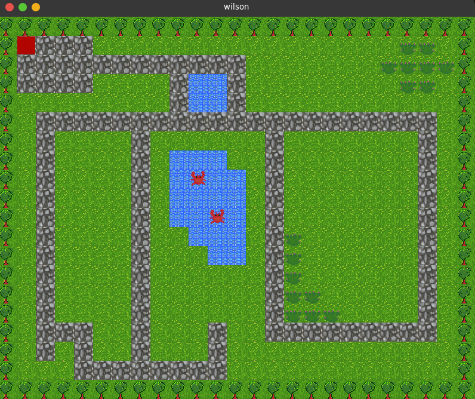

# Wilson
Wilson is a basic game enigne built on top of SFML.

In this demo the tilemap is core to the gameplay, tree and water tiles are not passable by the player.
Move the player with the arrow keys.

### Requirements met:
- 2 new components
  - Tilemap
  - Player
- Tilemap Serialisation
- Collision with tilemap


## Build
```bash
git clone git@github.com:jackdelahunt/wilson.git
```
```bash
cd wilson
```
```bash
mkdir build
```
```bash
cd build
```
```bash
cmake ../
```
```bash
make
```
```bash
cp -r ../resources/ .
```
```bash
cp -r ../data/ .
```
```bash
./wilson
```